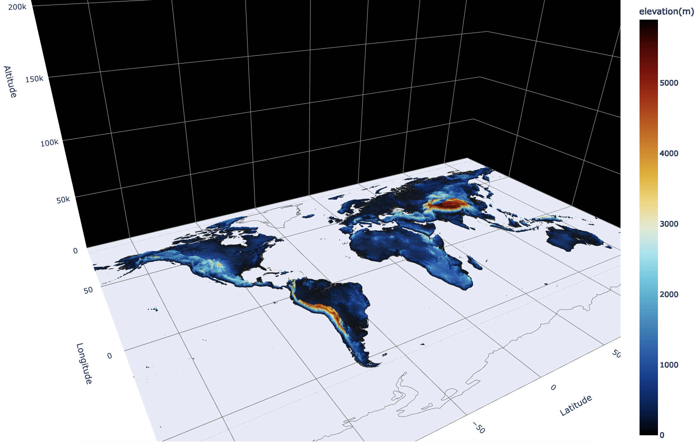

## **Plotly 3D Topographic Basemap**
#### Contents:
- [**Data Scrape**](./basemap_scrape.ipynb): Data obtained via [Earth Explorer](https://earthexplorer.usgs.gov/) and applet created by The United States Geological Survey.
- [**Map Build**](./basemap.ipynb)

